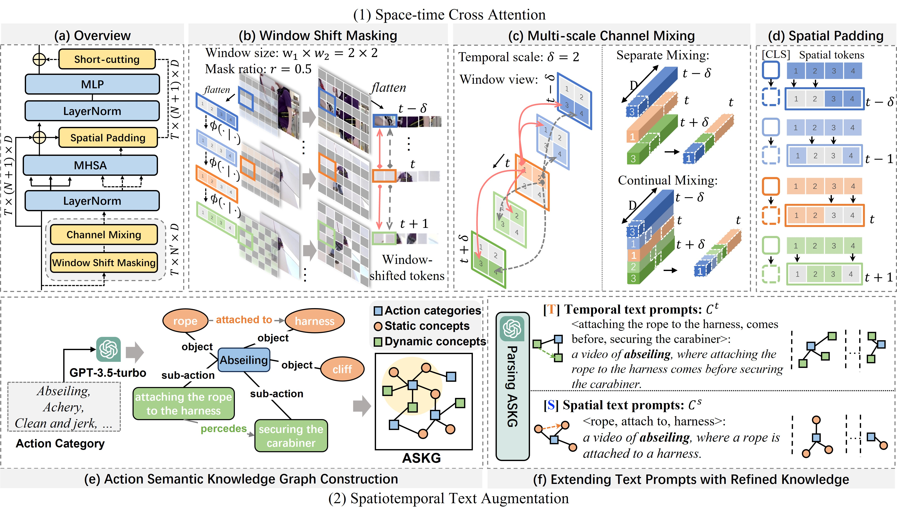

# Spatiotemporal Dynamic Duo
This repository contains the official Pytorch implementation of our paper:

- **"Building a Multi-modal Spatiotemporal Expert for Zero-shot Action Recognition with CLIP" (AAAI 2025)** [[`Paper`]](https://arxiv.org/pdf/2412.09895)

  Yating Yu, Congqi Cao, Yueran Zhang, Qinyi Lv, Lingtong Min, Yanning Zhang

# Introduction



This paper presents a novel CLIP-based framework, **Spatiotemporal Dynamic Duo** (STDD), designed to comprehend multi-modal spatiotemporal dynamics flexibly through simple yet effective operations applied before and after spatial attention for the vision modality and refining semantic modality with spatiotemporal text augmentation.

# Dependency

The main dependent packages include: PyTorch 1.13.1 and torchvision 0.14.1 and [`PySlowFast`](https://github.com/facebookresearch/SlowFast)

Detailed Installation instruction can be viewed in [`INSTALL.md`](https://github.com/wengzejia1/Open-VCLIP/blob/main/INSTALL.md).

# Data Preparation

- **Kinetics-400.**

  We prepare Kinetics-400 dataset by the  [`script`](https://github.com/open-mmlab/mmaction2/blob/main/tools/data/kinetics/download_videos.sh) provided by MMAction2.

- **UCF-101.**

  We download UCF-101 dataset by the [`script`](https://github.com/open-mmlab/mmaction2/blob/main/tools/data/ucf101/download_videos.sh) provided by MMAction2.

- **HMDB-51.**

  We download the HMDB-51 dataset by the [`script`](https://github.com/open-mmlab/mmaction2/blob/main/tools/data/hmdb51/download_videos.sh) provided by MMAction2.

- **Kinetics-600 testing.**

  The validation data of Kinetics-600 we used can be downloaded from [`link`](https://pan.baidu.com/s/1d6wI-n3igMdE1rJ2xP2MsA?pwd=c5mu).

# Text Augmentation

The prompts we used for Action Sementic Knowledge Graph construction and text prompts generation are provided in [utils/ASKG_text_prompt.py](utils/ASKG_text_prompt.py) and [utils/extended_text_prompt.py](utils/extended_text_prompt.py). Note that we perform a two-stage prompting pipeline, where the ASKG is contructed before generating extended text prompts. You also need to modify the `OPENAI_API_KEY` in [.env](.env).

The implementation for obtaining text features of extended text prompts can be referred to [utils/text_prompts.py](utils/text_prompts.py) or [text_prompts.ipynb]().

We provide the generated results of Action Sementic Knowledge Graph and extended text prompts in [label_db/classes_ASKG_k400.yml](label_db/classes_ASKG_k400.yml) and [label_db/classes_xprompt_k400.yml](label_db/classes_xprompt_k400.yml), respectively.

We also upload the Kinectics 400 and UCF-101 text features obtained by spatiotemproal text augmentation, which can be downloaded through the following links:

- text features:[ `https://drive.google.com/drive/folders/18-Ud1S1pq43SDXV5TbEpINEbsEQS1pCX?usp=sharing`](https://drive.google.com/drive/folders/18-Ud1S1pq43SDXV5TbEpINEbsEQS1pCX?usp=sharing)

# Acknowledgement

This repository is built upon [`FROSTER`](https://github.com/Visual-AI/FROSTER), [`OpenVCLIP`](https://github.com/wengzejia1/Open-VCLIP), [`PySlowFast`](https://github.com/facebookresearch/SlowFast) and [`CLIP`](https://github.com/openai/CLIP). Thanks for those well-organized codebases.

# Training

Training scripts of STDD are provided in **/script/training**. An example script can be viewed bellow.

```bash
ROOT=/PATH/TO/STDD
CKPT=/PATH/FOR/SAVING/CKPT/

# DATA.PATH_PREFIX   # need to replace with the path of the dataset
# TRAIN.CLIP_ORI_PATH # need to replace with the path of CLIP weights
# MODEL.TEMPORAL_MODELING_TYPE # selection of temporal modeling module
# DATA.TEXT_AUG_FEATURE_FILE # need to replace with the path of text feature file

cd $ROOT
export PYTHONPATH=$ROOT/slowfast:$PYTHONPATH
  python -W ignore -u tools/run_net.py \
  --cfg configs/Kinetics/TemporalCLIP_vitb16_8x16_STAdapter.yaml \
  --opts DATA.PATH_TO_DATA_DIR $ROOT/label_db/weng_compress_full_splits \
  DATA.PATH_PREFIX /data/Kinetics-400/raw/videos_se256 \
  DATA.PATH_LABEL_SEPARATOR , \
  DATA.INDEX_LABEL_MAPPING_FILE $ROOT/label_db/k400-index2cls.json \
  DATA.TEXT_AUG True \
  DATA.TEXT_AUG_FEATURE_FILE $CKPT/text_feats/classes_text_feats_k400_tpl8_xmix_ViT-B_16.pt \
  TRAIN.ENABLE True \
  OUTPUT_DIR $CKPT/STDD_ch32_ts1+2/vitb16_8x16 \
  TRAIN.BATCH_SIZE 32 \
  TEST.BATCH_SIZE 64 \
  TEST.NUM_ENSEMBLE_VIEWS 3 \
  TEST.NUM_SPATIAL_CROPS 1 \
  NUM_GPUS 4 \
  SOLVER.MAX_EPOCH 22 \
  SOLVER.WARMUP_EPOCHS 2.0 \
  SOLVER.BASE_LR 3.33e-6 \
  SOLVER.WARMUP_START_LR 3.33e-8 \
  SOLVER.COSINE_END_LR 3.33e-8 \
  TRAIN.MIXED_PRECISION True \
  DATA.DECODING_BACKEND "pyav" \
  MODEL.NUM_CLASSES 400 \
  MODEL.TEMPORAL_MODELING_TYPE 'stcross_attend' \
  MIXUP.ENABLE False \
  AUG.ENABLE False \
  AUG.NUM_SAMPLE 1 \
  TRAIN.EVAL_PERIOD 1 \
  TRAIN.CHECKPOINT_PERIOD 1 \
  MODEL.LOSS_FUNC soft_cross_entropy \
  TRAIN.LINEAR_CONNECT_CLIMB False \
  TRAIN.LINEAR_CONNECT_LOSS_RATIO 0.0 \
  TRAIN.CLIP_ORI_PATH /.cache/clip/ViT-B-16.pt \
  MODEL.CHANNEL_FOLD 32 \
  MODEL.TEMPORAL_SCALE [1,2] \
  MODEL.RAW_MODEL_DISTILLATION True \
  MODEL.KEEP_RAW_MODEL True \
  MODEL.DISTILLATION_RATIO 2.0 \
```

To improve the generalizability of your model, after training, you can use `weight_average_tool.py` to average the models from different epochs. **We also provide several model ensemble alternatives**. The source folder `source_dir` should be changed according to your saved path.

```bash
python weight_average_tool.py
```

# Citation

```
@article{yu2024building,
  title={Building a Multi-modal Spatiotemporal Expert for Zero-shot Action Recognition with CLIP},
  author={Yu, Yating and Cao, Congqi and Zhang, Yueran and Lv, Qinyi and Min, Lingtong and Zhang, Yanning},
  journal={arXiv preprint arXiv:2412.09895},
  year={2024}
}
```

